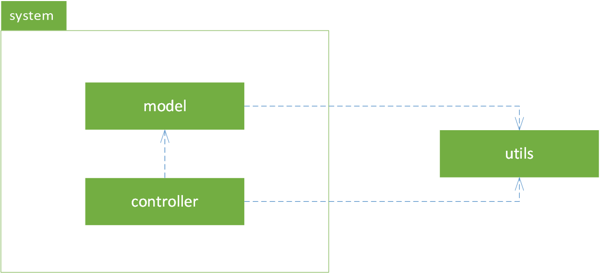
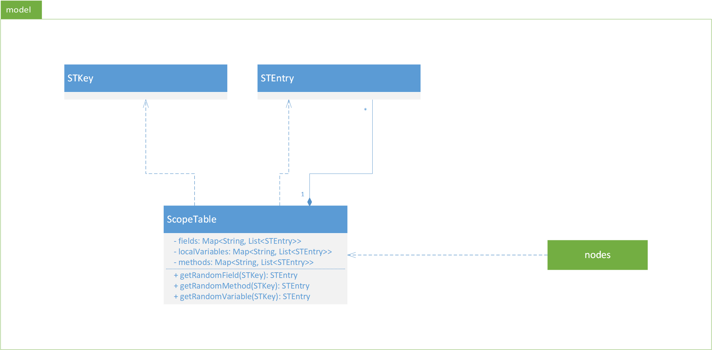
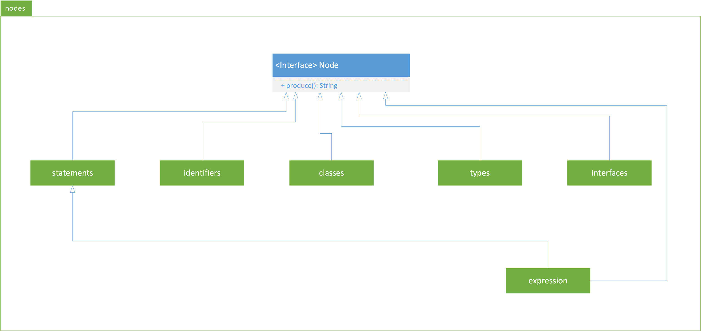
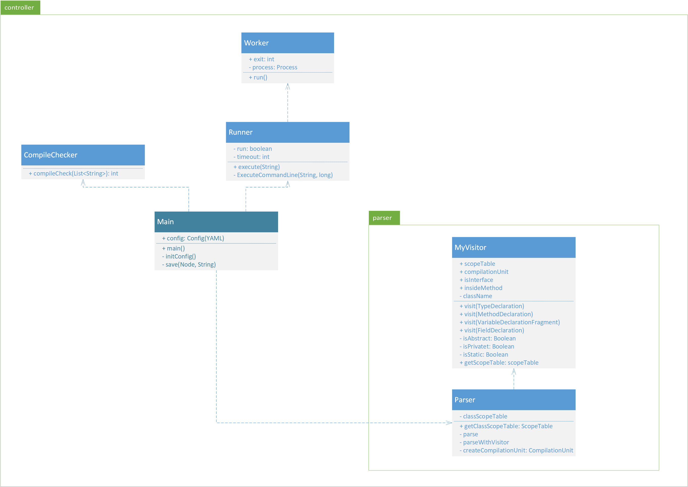

# CS474 course project

## Team

### Giovanni Agugini Bassi UIN: 659013265

### Guido Muscioni UIN: 652520943

### Riccardo Pressiani UIN: 652620943

Project of Object Oriented Languages and Environments 

### README outline

Below the outline of the readme is reported:

* Introduction
* Architecture
	* UML class diagrams
	* MAin choices
* Implementation
* Considered grammar
* External libraries used
* Functionalities
* Analysis

## Introduction

The course project requires to implement a random java program generator, based on a subset of the java grammar specification. The project requires also that the generator must be configured with a configuration file. Thus at the start of the project we focus on three main tash:

* Defining the architecture for the entire project
* Defining the grammar and the subset of it
* Defining a structure for the configuration file

The following section explains the design choices, the architecture and the implementation that we have done working on this project.

## Architecture and UML class diagrams

The architecture of our project is based on the Model-Controller pattern. In particular, the Model contains the data structure that allows the source code creation and the Controller contains the logic for the program creation and all the task we want to perform on the generated code.

The following figure shows the main package organization of our project, thus the system package, that contains the Model-Controller pattern and the utils package.

The model contains the data structures that handle the java grammar and allows the source code generation. The ScopeTable class is a class used to saved the variables, fields and methods that can be reused by other methods through the entire generated source.

The core component of the Model is contained in the package nodes. This package has all the classes needed to implement the considered grammar. Each class extends the node interface to ensure a hierarchy that allows a better code organization.

The following two images shows the class diagram for both the two package mentioned before, coupled with the modules dependecies.

Regarding the controller, the following image shows the class diagram. The package contains the Main class, thus is the entry point for our implementation. The package parser and the classes that are connected to the Main are explained in the next sections.

## Considered grammar

We have decided to consider for that project the grammar of the java version 8. Under src/main/resources there is a file called Java8.g4, this is the grammar structure we have considered for the entire project. Inside each class contained in the nodes package there is a comment providing the considered production. In actual fact, each node implements a specific production and to produce the source code we strictly follow the productions of the Java8.g4 file.

## Implementation

The implementation of the project has followed a greedy approach. We started from a single production and continuosly adding new nodes we have reachede the actual point.

As it is mentioned before, the code is generated following the productions of the grammar. In details, each node contains a method produce() that returns the code generated by a node. This method is called from each production until a terminal node (T) is reached. Thus T return a String and the calling produce() method returns, that pattern is followed until the first produce() is reached. Finally the composed String is returned to the controller.

The controller handles the creations of all the source code, both classes and interface have been taken into consideration. 

The controller is responsible for handling the condifguration file. The method initConfig() is used to read and parse the configuration file, written following the YAML syntax. Each of the configuration value is taken and our implementation strictly followed each of the parameter contained in the configuration file (we have used jackson for parsing the YAML file, go to the next section for further details).

The controller is responsible also for the correct class scope tables creation, in particular for each interface and iteratively for each class the controller uses the parser to retrieve the correct scope table.

Furthermore, the controller does not end the computation with the source code generation. After the generation the controller follows two main task:

* Code verification
* Code execution

These two functionalities are described in the functionality section.

## External libraries used

Accross the entire project we have used different external libraries. The following section mention all of them.

### Jackson

Jackson is a library used for parsing JSON, YAML and many other file format. We have used it to parse and verify the correctness syntax of the configuration file. 

More details about Jackson and its main functionalities can be found here : https://github.com/FasterXML/jackson

### JDT

We have used the JDT core library to parse the generated source code. In particular as we gain experience with the AST Parser we have decided to used it for the class scope and interface scope table creation.

The implementation is inside the parser package.

### Generex

Generex is a library used for generating regular expression. We have used it for creating any literal required by the java grammar. Each method, variable, interface name is generated using the Generex library.

### JUnit

We have used JUnit to test the most important class of our implementation: the ScopeTable. That has been made in order to guaranted all the functionalities provided by this class.

## Added functionalities

Besides the source code generation required by the project assignment we have also implementated two other main task. The following sections describe them in details.

### Code verification

The code verification step ensures that the generated code can compile. 

The CompileChecker class is responsible for doing that. The code is compiled using the java tools, and the output of the compilation is saved under generatedSrc/out.

During the code generation we keep track of each generated source file, interface or class does not matter. We save all the file names in a list that is passed as parameter to the class. The compileCheck method return 0 if the compilation succed.

### Code execution 

If the code verification return 0, our implementation has the possibility to run the code for a defined amount of time.

The configuration file contains two parameter that are used to ensure the execution of the generated code and to set the time interval in which the program has to execute.

The implementation is contained in the Runner class. We have decided to set a timeout as if the user ask, in the configuration file, for a very high number of classes or interfaces or statements, the generated code could execute for hours. Thus the code is launched using a time defined worker that end the computation after the timeout setted in the configuration file has elapsed.

### Time execution analysis

We have also implemented a simple timing for the entire program execution. At the end of the execution the program will print the statistics for the just finished execution. All the time are shown in milliseconds.

## Analysis

## Output example

	[INTERFACE GENERATOR] Generation successful: Q7BaxSem
	[INTERFACE GENERATOR] Generation successful: X1xJ0x
	[INTERFACE GENERATOR] Generation successful: Ov5hWhOL0
	[CLASS GENERATOR] Generation successful: Main
	[CLASS GENERATOR] Generation successful: Main1
	[CLASS GENERATOR] Generation successful: Main2
	[CLASS GENERATOR] Generation successful: Main3
	[COMPILER] Compilation successful
	[RUNNER] Running
	[RUNNER] Executed command: java -cp generatedSrc/out/ Main3
	[RUNNER] End execution
	[STATS] Interface generation time: 1361 ms
	[STATS] Class generation time: 464 ms
	[STATS] Compilation time: 1002 ms
	[STATS] Execution time: 192 ms
	[STATS] Total time: 3928 ms

